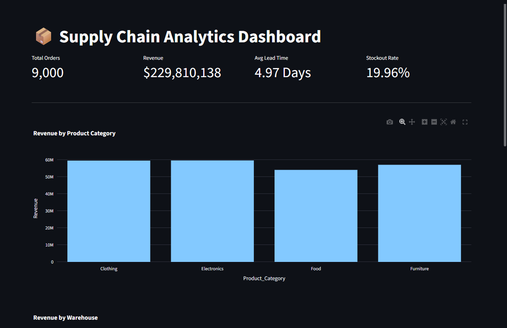
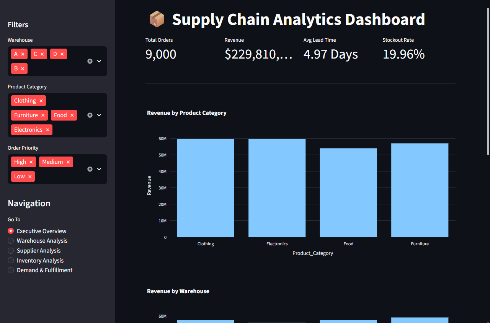
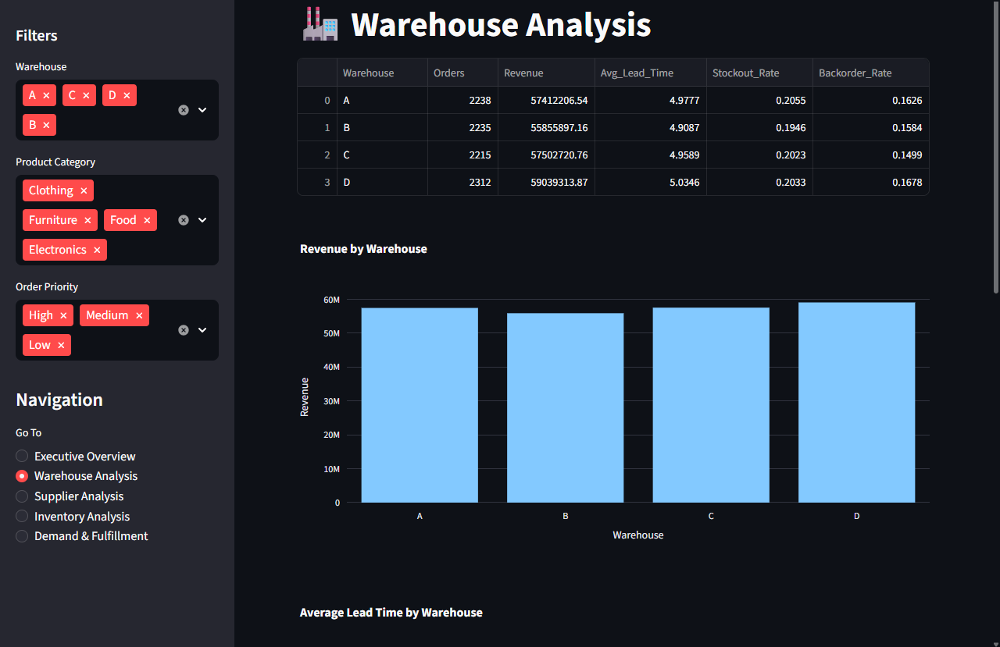
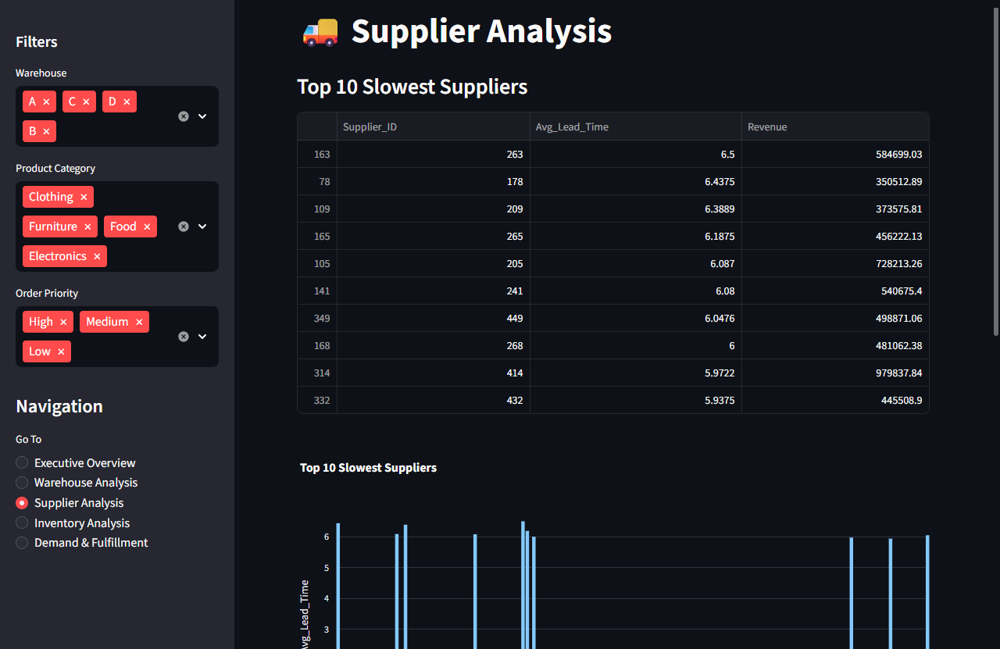
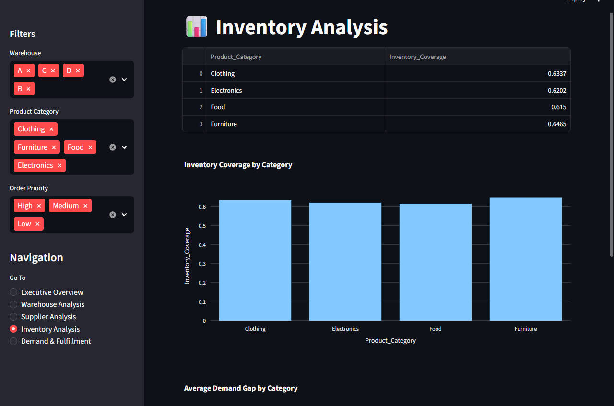
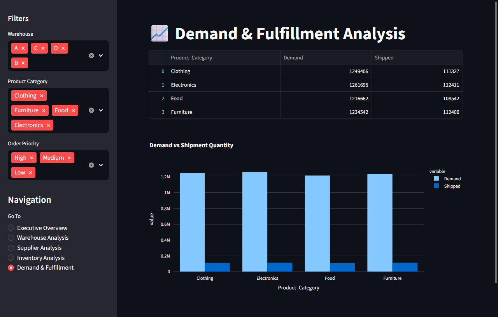

# 📦 Supply Chain Analytics Dashboard

## Overview

This project analyzes supply chain operations using Python, SQL, and Streamlit to identify operational inefficiencies, inventory risks, supplier performance issues, and revenue opportunities.

The project follows an end-to-end analytics workflow, including data cleaning, exploratory data analysis (EDA), SQL-based business analysis, and the development of an interactive Streamlit dashboard.

---

## Business Problem

Supply chain managers need visibility into:

* Warehouse performance
* Supplier efficiency
* Inventory shortages
* Demand fulfillment
* Revenue contribution by product categories

This project helps answer these questions through data-driven analysis and interactive visualizations.

---

## Dataset Information

The dataset contains **9,000 supply chain transactions** and includes:

| Feature           | Description                     |
| ----------------- | ------------------------------- |
| Product_ID        | Unique product identifier       |
| Warehouse         | Warehouse location              |
| Order_Date        | Date order was placed           |
| Shipment_Date     | Date shipment was completed     |
| Lead_Time         | Days between order and shipment |
| Demand_Forecast   | Forecasted demand               |
| Inventory_Level   | Available inventory             |
| Stockout_Flag     | Stockout indicator              |
| Backorder_Flag    | Backorder indicator             |
| Supplier_ID       | Supplier identifier             |
| Order_Quantity    | Ordered quantity                |
| Shipment_Quantity | Shipped quantity                |
| Product_Category  | Product category                |
| Product_Price     | Product price                   |
| Customer_ID       | Customer identifier             |
| Order_Priority    | Order priority level            |

---

## Tech Stack

### Data Analysis

* Python
* Pandas
* NumPy
* Matplotlib
* Seaborn

### SQL Analysis

* MySQL
* Aggregate Functions
* GROUP BY
* Window Functions
* Common Table Expressions (CTEs)

### Dashboard

* Streamlit
* Plotly

---

## Project Workflow

```text
Raw Dataset
    ↓
Data Cleaning
    ↓
Exploratory Data Analysis (EDA)
    ↓
Business Analysis
    ↓
SQL Analysis
    ↓
Interactive Streamlit Dashboard
    ↓
Business Recommendations
```

---

## Exploratory Data Analysis

Performed:

* Missing value analysis
* Duplicate checks
* Data type corrections
* Numerical feature analysis
* Categorical feature analysis
* Correlation analysis
* Distribution analysis

---

## Business Analysis

Key business questions explored:

1. Which warehouse generates the highest revenue?
2. Which warehouse has the highest stockout rate?
3. Which suppliers have the longest lead times?
4. Which product categories contribute the most revenue?
5. Which categories experience the largest demand gap?
6. Are high-priority orders fulfilled faster?
7. Which categories face inventory shortages?

---

## SQL Analysis

Implemented multiple business-focused SQL queries, including:

* Warehouse performance analysis
* Supplier performance ranking
* Revenue analysis
* Inventory coverage analysis
* Demand gap analysis
* Fulfillment analysis
* Window function ranking queries

---

## Dashboard Features

### Executive Overview

* Total Orders
* Total Revenue
* Average Lead Time
* Stockout Rate
* Revenue Trends

### Warehouse Analysis

* Revenue by Warehouse
* Lead Time by Warehouse
* Stockout Rate by Warehouse

### Supplier Analysis

* Top Slowest Suppliers
* Supplier Revenue Analysis

### Inventory Analysis

* Inventory Coverage
* Demand Gap Analysis

### Demand & Fulfillment

* Demand vs Shipment Comparison
* Fulfillment Performance

### Interactive Filters

* Warehouse Filter
* Product Category Filter
* Order Priority Filter

---

## Key Insights

* Identified top-performing warehouses based on revenue generation.
* Evaluated warehouse operational efficiency using lead time and stockout metrics.
* Ranked suppliers based on delivery performance.
* Detected categories with inventory shortages through inventory coverage analysis.
* Measured demand gaps to identify fulfillment risks.
* Analyzed the impact of order priority on operational performance.

---

------------------------------------------------------------------------

# Dashboard Preview

### Dataset Analysis















--------------------------------------------------------------------------

## Project Structure

```text
Supply_Chain_Analysis/
│
├── data/
│   ├── raw/
│   └── processed/
│
├── notebooks/
│   ├── data_cleaning.ipynb
│   ├── eda.ipynb
│   └── business_analysis.ipynb
│
├── sql/
│   ├── business_queries.sql
│   └── schema.sql
├── reports/
│   ├── sql_business_insights.pdf
│
├── .gitignore
├── .env
├── app.py
├── requirements.txt
└── README.md
```

---


## Installation

Clone the repository:

```bash
git clone <repository-url>
cd Supply_Chain_Analytics
```

Install dependencies:

```bash
pip install -r requirements.txt
```

Run the Streamlit dashboard:

```bash
streamlit run app.py
```

---

## Future Improvements

* Predictive demand forecasting
* Inventory optimization models
* Supplier risk scoring
* Real-time dashboard integration
* Automated alert system for stockouts

---

## Author

Data Analytics Portfolio Project demonstrating:

* Data Cleaning
* Exploratory Data Analysis
* SQL Analytics
* Business Intelligence
* Dashboard Development
* Business Insight Generation
